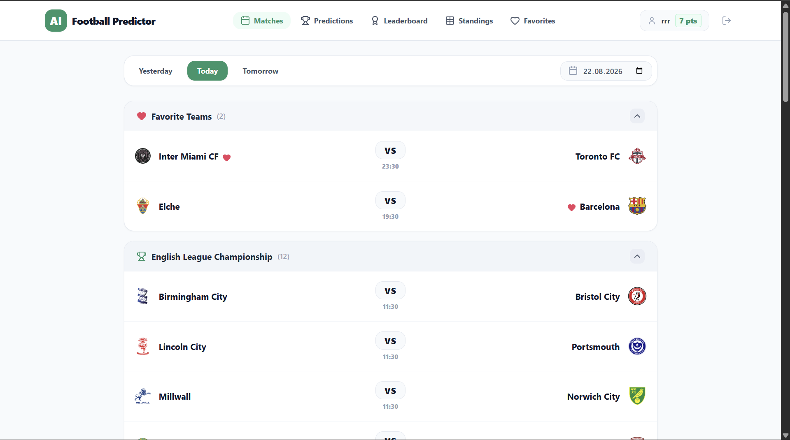
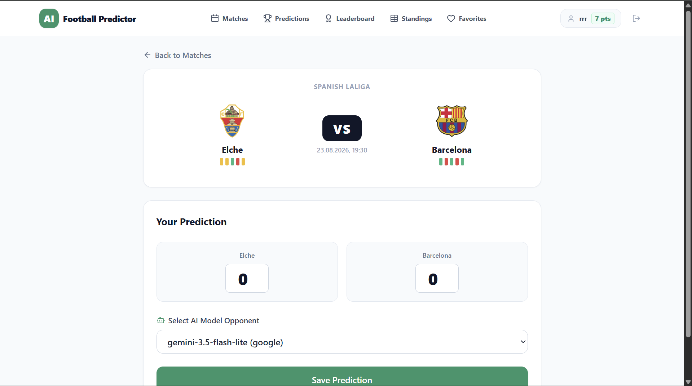
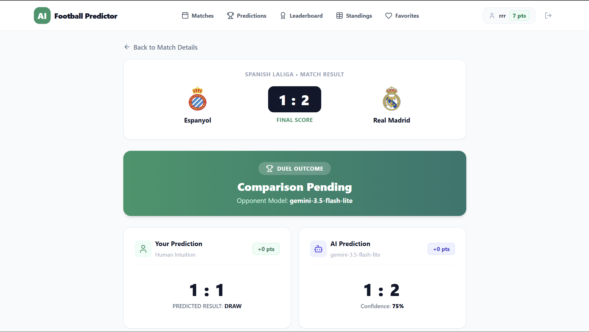
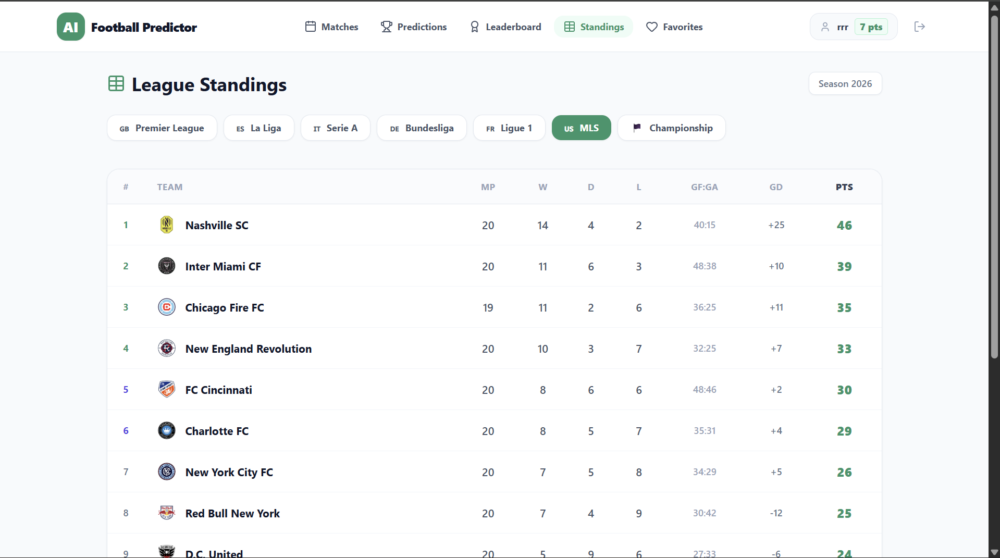
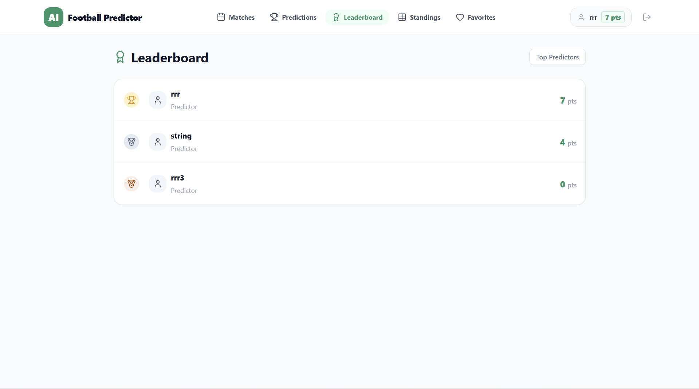
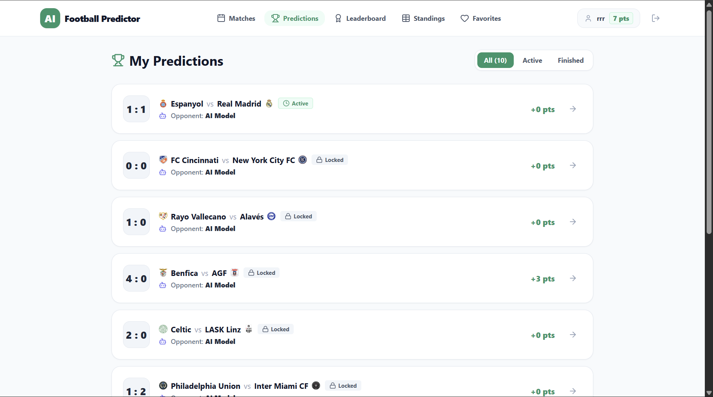

<div align="center">

# ⚽ AI Football Predictor Battle

### *Can LLMs outsmart football fans?*

[](https://fastapi.tiangolo.com)
[](https://react.dev)
[](https://www.typescriptlang.org/)
[](https://ai.google.dev/)
[](https://tailwindcss.com/)
[](https://www.docker.com/)
[](https://opensource.org/licenses/MIT)

[Features](#-key-features) •
[Screenshots](#-screenshots--ui-preview) •
[Scoring System](#-how-the-scoring--duel-system-works) •
[Tech Stack](#-tech-stack) •
[Quick Start](#-quick-start) •
[API Reference](#-api-endpoints)

</div>

---

## 📌 Overview

**AI Football Predictor Battle** is a modern web platform where football enthusiasts can test their match prediction skills against **AI models** (powered by Google Gemini only for now). 

The website automatically gathers information about live matches, odds, and team statistics on ESPN, asks the AI models to predict the results with explanations and evaluates both users' and LLMs' performance after the matches are over.

---

## 📸 Screenshots & UI Preview

### 1. Match Fixtures & Daily Feed
*Grouped by league, live status tags, odds summary, and favorite team highlights.*

<p align="center">
  
</p>

---

### 2. Match Details & Prediction Submission
*Interactive score input, dynamic form badges, and AI opponent selector.*

<p align="center">
  
</p>

---

### 3. Post-Match AI Duel Comparison
*Head-to-head breakdown showing human result vs. LLM result*

<p align="center">
  
</p>

---

### 4. Standings
*Full league tables*

<p align="center">
  
</p>

---

### 5. Leaderboard
*best users by points*

<p align="center">
  
</p>

---

### 6. My predictions
*all users predictions*

<p align="center">
  
</p>

---

## ✨ Key Features

-  **Human vs. AI**: Predict scores and compete with AI (`gemini-3.5-flash-lite`, `gemini-2.0-pro`).
-  **Live Data Syncing**: Automatic live synchronization of fixtures, matches, statistics, odds, and standings through ESPN API.
-  **Smart Scoring Engine**: Multi-tier point distribution (Outcome, Goal Diff, Exact Score).
-  **Post-Match Duel Evaluation**: Resolves match outcomes to `user_won`, `llm_won`, or `draw`.
-  **Dynamic Standings**: Real-time league tables across Premier League, La Liga, Serie A, Bundesliga, Ligue 1, MLS, and Championship.
-  **Favorite Teams**: Bookmark clubs to automatically highlight their upcoming fixtures.
-  **Secure Authentication**: JWT Access & Refresh token rotation with silent Axios client refresh interceptors.
-  **Background Automation**: Background synchronization of matches, AI generation, and points calculation using APScheduler.
- **Fully Non-Blocking I/O:** Built with Python 3.12, FastAPI, and `aiosqlite` with async SQLAlchemy 2.0 ORM sessions.

---


---

## 🛠 Tech Stack 

### **Backend**
- **Framework:** FastAPI (Python 3.12)
- **Database & ORM:** SQLite / PostgreSQL with async SQLAlchemy 2.0 & `aiosqlite`
- **Scheduler:** APScheduler (AsyncIOScheduler)
- **AI Integration:** Google Gemini API (`google-genai` SDK)
- **Data Ingestion:** HTTPX async client (ESPN Scoreboard & Standings endpoints)
- **Security:** Passlib (Bcrypt) + PyJWT (Access + Refresh tokens)
- **Package Manager:** [Astral UV](https://github.com/astral-sh/uv)

### **Frontend**
- **Framework:** React 19 + TypeScript + Vite 8
- **Styling:** Tailwind CSS 3.4
- **State & Caching:** TanStack React Query v5
- **Routing:** React Router DOM v7
- **HTTP Client:** Axios (with automatic 401 token refresh queue)
- **Icons:** Lucide React

### **DevOps & Deployment**
- **Docker Compose:** Multi-stage build (FastAPI + Nginx Reverse Proxy)
- **Web Server:** Nginx Alpine (production frontend hosting & API proxy)

---

## 📁 Repository Structure (backend)

```text
├── app/                          # Backend Application Core
│   ├── api/
│   │   ├── dependencies.py       # Auth guards & DB session dependency
│   │   └── routes/               # Modular API routes (auth, matches, llm, teams...)
│   ├── core/                     # Config, database engine, security & JWT logic
│   ├── scheduler/                # APScheduler cron jobs (sync, score, AI generation)
│   ├── utils/                    # Date formatting, ESPN parsers, points calculation
│   └── main.py                   # FastAPI initialization & lifespan configuration
├── models/                       # SQLAlchemy Database Models (Match, User, Prediction, Standing...)
├── schemas/                      # Pydantic v2 validation models
├── services/                     # Business logic (ESPN clients, LLM prompts, Match sync)
├── tests/                        # Integration & Unit test suite (pytest)
│
│
├── docker-compose.yml            # Container orchestration config
├── Dockerfile                    # Backend container definition (uv + python)
└── pyproject.toml                # Python dependencies & metadata

## 🚀 Quick Start

### 🐳 Option A: Instant Run via Docker Hub (Recommended)

No local compilers or repositories required. Pull and run pre-built images directly:

1. **Create a `docker-compose.yml` file:**
```yaml
version: '3.8'

services:
  backend:
    image: vit1919/football-backend:latest
    container_name: football_api
    ports:
      - "8000:8000"
    env_file:
      - .env
    volumes:
      - ./football_predictions.db:/app/football_predictions.db
    restart: always

  frontend:
    image: vit1919/football-frontend:latest
    container_name: football_ui
    ports:
      - "80:80"
    depends_on:
      - backend
    restart: always
```

2. **Create a `.env` file in the same directory:**
```env
DATABASE_URL=sqlite+aiosqlite:///./football_predictions.db
JWT_SECRET_KEY=your_secure_random_jwt_secret_key
ALGORITHM=HS256
GOOGLE_API_KEY=your_gemini_api_key_here
```

3. **Start the containers:**
```bash
docker compose up -d
```
* **Frontend:** [http://localhost](http://localhost)
* **Interactive Swagger API:** [http://localhost:8000/docs](http://localhost:8000/docs)

---

### 💻 Option B: Local Development Setup

To modify source code across services:

**1. Backend Setup**
```bash
git clone [https://github.com/vit1919/ai-football-predictor.git](https://github.com/vit1919/ai-football-predictor.git)
cd ai-football-predictor

# Install dependencies using Astral UV
uv sync

# Configure environment
cp .env.example .env
# Fill in your GOOGLE_API_KEY and JWT_SECRET_KEY

# Run server with hot reload
uv run uvicorn app.main:app --host 127.0.0.1 --port 8000 --reload
```

**2. Frontend Setup**
```bash
# In a separate terminal
git clone [https://github.com/vit1919/ai_football_front.git](https://github.com/vit1919/ai_football_front.git)
cd ai_football_front

npm install
echo "VITE_API_URL=[http://127.0.0.1:8000](http://127.0.0.1:8000)" > .env.development
npm run dev
```

---

# ⏰ Background Jobs (APScheduler)

The system automatically runs periodic async jobs:

| Job Name                  | Interval      | Description                                                     |
| :------------------------ | :-----------: | :-------------------------------------------------------------- |
| `sync_matches`            | Every 30 mins | Pulls fixtures, scores, form, and odds from ESPN.               |
| `score_predictions`       | Every 10 mins | Calculates points for finished matches and settles AI Duels.    |
| `generate_ai_predictions` | Every 10 mins | Auto-generates AI predictions for games starting in \<15 mins.  |
| `sync_standings`          | Every 30 mins | Refreshes league standings, point totals, and goal differences. |


# 🧪 Running Tests

The test suite includes full integration flows (E2E lifecycle, auth token
rotation, scoring algorithms, and mocked ESPN/LLM handlers):

# Run pytest with async support
uv run pytest -v

# Run with test coverage
uv run pytest --cov=app --cov=services

# 🔌 API Endpoints (Overview)

| Method   | Endpoint                      | Description                                          | Auth Required |
| :------- | :---------------------------- | :--------------------------------------------------- | :-----------: |
| `POST`   | `/auth/register`              | Register a new user                                  | ❌             |
| `POST`   | `/auth/login`                 | Log in and receive Access + Refresh tokens           | ❌             |
| `POST`   | `/auth/refresh`               | Rotate tokens using a valid refresh token            | ❌             |
| `GET`    | `/auth/me`                    | Fetch currently logged-in user profile               | ✅             |
| `GET`    | `/matches`                    | Filter fixtures by date and league                   | ❌             |
| `GET`    | `/matches/today`              | Get today's fixtures across supported leagues        | ❌             |
| `GET`    | `/matches/{event_id}`         | Detailed match data + user prediction status         | Optional      |
| `GET`    | `/matches/{event_id}/compare` | Get final post-match Human vs. AI duel summary       | Optional      |
| `POST`   | `/predictions`                | Submit a score prediction and select AI rival        | ✅             |
| `GET`    | `/predictions/me`             | List user predictions (Active / Locked)              | ✅             |
| `PATCH`  | `/predictions/{id}`           | Update score prediction (only before kickoff)        | ✅             |
| `DELETE` | `/predictions/{id}`           | Remove prediction (only before kickoff)              | ✅             |
| `GET`    | `/standings/{league_slug}`    | Get live league table standings                      | ❌             |
| `GET`    | `/leaderboard`                | View top predictor rankings by total points          | ❌             |
| `GET`    | `/llm/models`                 | List available LLMs for dueling                      | ❌             |
| `GET`    | `/llm/stats/vs-user`          | Global stats (Community wins vs AI / Draws / Losses) | ❌             |


